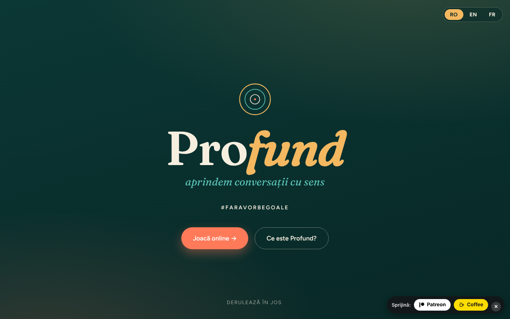

# Profund

Joc de întrebări „fără-troc" (trade-free) pentru conversații cu sens — #FaraVorbeGoale.

**Live:** https://chiuta.github.io/Profund/

## Ce este

Profund este un joc de 150 de cărți cu întrebări care deschid conversații, într-un singur fișier HTML. Textul din aplicație îl descrie ca adaptare română / engleză / franceză după deepcards.org, proiect din ecosistemul TROM. Se poate juca online (cărți care se întorc la apăsare) sau offline, prin cărți tipărite.

## Funcții

- Interfață în română, engleză și franceză (butoane RO / EN / FR).
- Prezentare: ce este jocul, cele trei idei ale lui și ce s-ar putea întâmpla.
- Patru moduri de joc descrise: „Ia & Răspunde" (2–6 persoane), „Ghicește" (2–6), „Declanșator de conversații" (4–20), „FărăRăspuns – TreciLaAcțiune" (2–10).
- Joc online: întrebările sunt în blocuri de câte 10; apeși pe o carte ca s-o întorci. Butoane „Carte la întâmplare", „Amestecă pachetul", „Următoarea carte".
- Joc offline: „Printează cărțile (PDF)" (150 de cărți, 3 pe rând, gata de decupat) și „Descarcă întrebările (text)".
- Formular de contact care pregătește un e-mail (mailto) către autor.

## Manual de utilizare

1. Alege limba din butoanele RO / EN / FR din partea de sus.
2. Citește secțiunea „Moduri de joc" și alege unul.
3. La „Joacă online" apasă „Carte la întâmplare" pentru o carte, „Amestecă pachetul" pentru a amesteca, apoi „Următoarea carte". Când pachetul se termină, amestecă din nou.
4. Pentru joc fizic, la „Joacă offline" apasă „Printează cărțile (PDF)", alege „Salvează ca PDF" sau imprimă, apoi decupează cărțile.
5. „Descarcă întrebările (text)" salvează întrebările într-un fișier text.
6. La „Contact" completezi numele, e-mailul, subiectul și mesajul și apeși „Trimite mesajul": se deschide clientul tău de e-mail cu un mesaj către alexio@trom.tf (aplicația nu are server).

## Confidențialitate și rețea

- Local: se păstrează doar limba aleasă, în `localStorage` (cheia `profund_lang`).
- Rețea: nu am găsit apeluri `fetch`, scripturi sau fonturi externe (fonturile sunt integrate în fișier). Textul din aplicație afirmă „fără bani, fără date".
- Linkurile din subsol și cele de susținere (deepcards.org, tiotrom.com, trade-free.org, Patreon, Buy Me a Coffee) se deschid doar dacă le apeși.
- Formularul de contact nu trimite date printr-un server; folosește `mailto:`.

## Rulare locală / offline

Descarcă `index.html` și deschide-l în browser; funcționează fără internet (linkurile externe necesită conexiune).

## Licență

CC0 1.0 Universal (domeniu public) — vezi fișierul LICENSE

## Autor

Alexio — Alexandru-Ionuț Chiuță, contact: alexio@trom.tf. Aplicația îl menționează ca voluntar TROM.

## English summary

Profund ("Deep") is a single-file trade-free question card game (150 cards) for meaningful conversations, in Romanian, English and French. It offers four ways to play, an online card deck, print-to-PDF cards and a text download. Only the chosen language is stored in localStorage; no external requests were found, and the contact form uses mailto. Adapted from deepcards.org. CC0.
